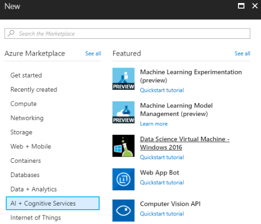
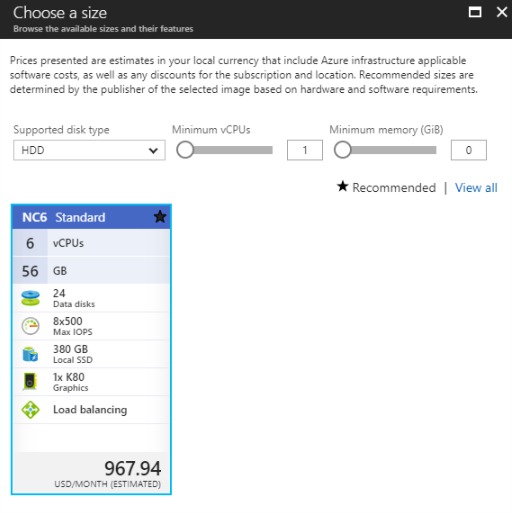
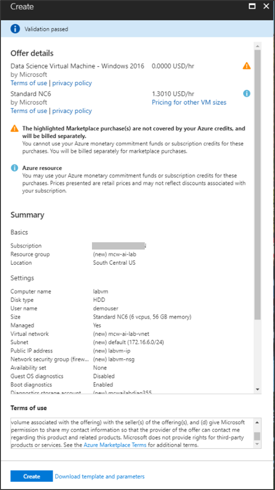
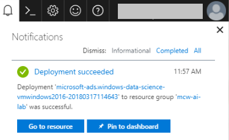
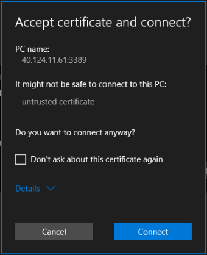
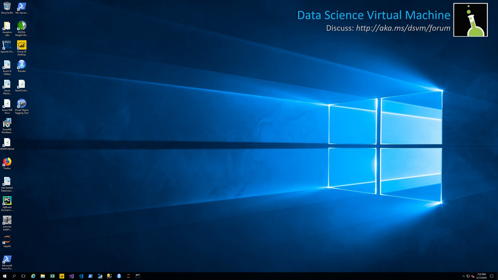
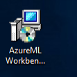
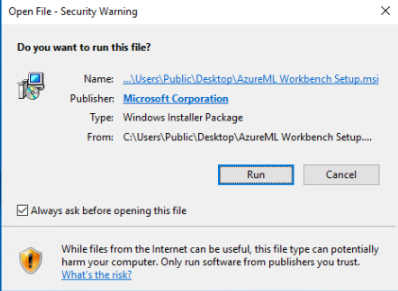
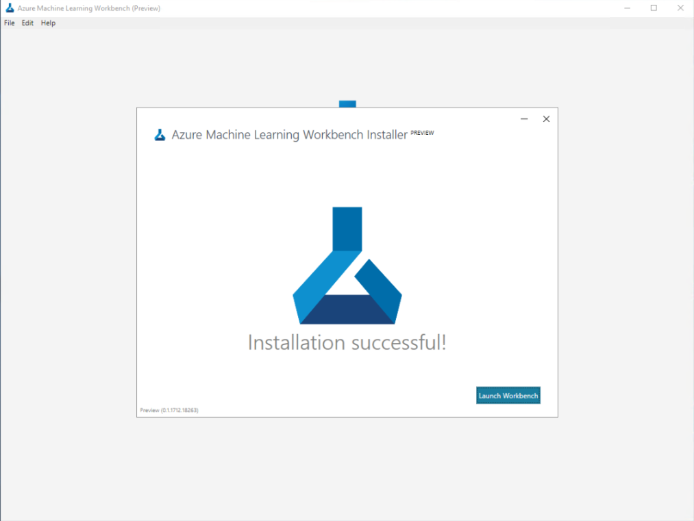

# Cognitive Services and Deep Learning setup

## Requirements

1.  Microsoft Azure subscription must be pay-as-you-go or MSDN

    a.  Trial subscriptions will not work

## Before the hands-on lab

Duration: 30 minutes

To maximize your lab time, the following steps which setup your environment should be performed before attending the lab.

#### Task 1: Provision the Windows Data Science Virtual Machine

1.  Navigate to the Azure Portal at <https://portal.azure.com>.

2.  Select **Create a resource**.\
    

3.  Select **AI + Cognitive Services** and then select **Data Science Virtual Machine Windows 2016**.\
    

4.  On the **Basics** blade provide the following inputs:

    a.  **Name**: enter labvm

    b.  **VM disk type**: select HDD. This will enable you to use a GPU based machine if you choose to in the subsequent step.

    c.  **User name**: enter demouser

    d.  **Password and Confirm Password:** enter Abc!1234567890

    e.  **Subscription**: select your Azure subscription

    f.  **Resource group**: select Create new and provide the name mcw-ai-lab

    g.  **Location**: select either South Central US or East US (or any of the regions in which the NC-series VM's are currently available, see the [regions service page](https://azure.microsoft.com/en-us/global-infrastructure/services/) for an up to date listing).

    

5.  Select **OK**.

6.  On the **Choose a size** blade, select **NC6 Standard** and choose **Select.**

    

7.  Leave all values on the Settings blade at their defaults and select OK.\
    

8.  On the Create blade, review the summary and then select Create.\
    

9.  The VM should take 10-15 minutes to provision.

#### Task 2: Verify Remote Desktop access to Data Science VM

1.  When the VM is ready, you should see a notification. Select **Go to resource** to view the deployed Data Science VM in the Portal.\
    

2.  On the blade for the VM, select **Connect**. This will download a Remote Desktop (RDP) file.

    

3.  Open the downloaded RDP file.

4.  At the prompt, ensure **Clipboard** is checked and select **Continue**.\
    

5.  Enter the **username** (demouser) and **password** (Abc!1234567890) and select **Connect** to login.\
    

6.  Select **Connect** on the dialog that follows.\
    

7.  Within a few moments, you should see the desktop for your new Data Science Virtual Machine.\
    

#### Task 3: Initialize Azure Machine Learning Workbench

Before using the Azure Machine Learning Workbench on the Data Science VM, you will need to take the one-time action of double-clicking on the AzureML Workbench Setup icon on the desktop to install your instance of the workbench.

1.  Within the RDP session to the Data Science VM, on the desktop locate the AzureML Workbench Setup.\
    

2.  Double-click the icon to install the Workbench.

3.  At the **Open File -- Security Warning** dialog, select **Run**.\
    

4.  Step through all the prompts leaving all values at their defaults to complete the Workbench installation. Installation will take about 25 minutes. Use the **X** to close the install when it is finished.

    

#### Task 4: Stop the Data Science VM

If you are performing this setup the night before the hands-on lab, you can optionally Stop the VM to save on costs overnight, and resume it when you are ready to start on the lab. Follow these steps to Stop the VM:

1.  Return to the Azure Portal.

2.  Navigate to the blade of your labvm.

3.  Select the **Stop** button.\
    

> **NOTE:** When you are ready to resume the VM, simply follow the previous steps and instead of selecting Stop, select **Start**. You VM will take about 5 minutes to start up, after which you can use the **Connect** button in the VM blade to RDP into the VM as before.

You should follow all steps provided *before* attending the hands-on lab.
