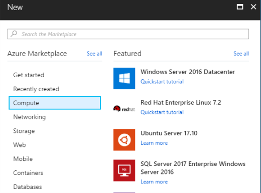
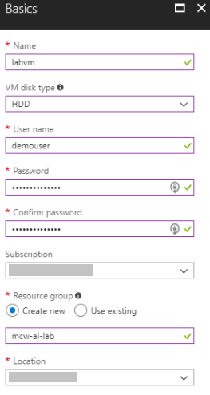
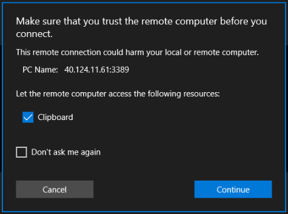
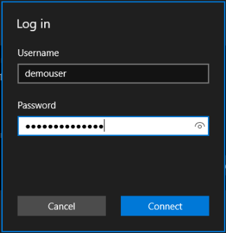
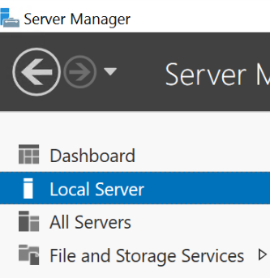
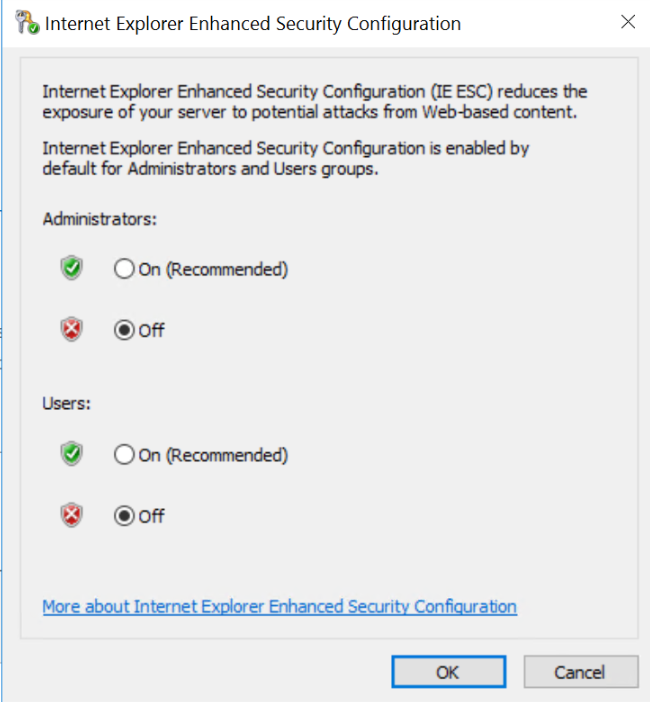
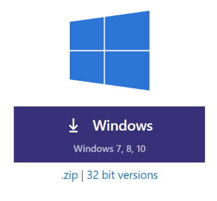

Cognitive services and deep learning

Before the hands-on lab setup guide

June 2018

Information in this document, including URL and other Internet Web site references, is subject to change without notice. Unless otherwise noted, the example companies, organizations, products, domain names, e-mail addresses, logos, people, places, and events depicted herein are fictitious, and no association with any real company, organization, product, domain name, e-mail address, logo, person, place or event is intended or should be inferred. Complying with all applicable copyright laws is the responsibility of the user. Without limiting the rights under copyright, no part of this document may be reproduced, stored in or introduced into a retrieval system, or transmitted in any form or by any means (electronic, mechanical, photocopying, recording, or otherwise), or for any purpose, without the express written permission of Microsoft Corporation.

Microsoft may have patents, patent applications, trademarks, copyrights, or other intellectual property rights covering subject matter in this document. Except as expressly provided in any written license agreement from Microsoft, the furnishing of this document does not give you any license to these patents, trademarks, copyrights, or other intellectual property.

The names of manufacturers, products, or URLs are provided for informational purposes only and Microsoft makes no representations and warranties, either expressed, implied, or statutory, regarding these manufacturers or the use of the products with any Microsoft technologies. The inclusion of a manufacturer or product does not imply endorsement of Microsoft of the manufacturer or product. Links may be provided to third party sites. Such sites are not under the control of Microsoft and Microsoft is not responsible for the contents of any linked site or any link contained in a linked site, or any changes or updates to such sites. Microsoft is not responsible for webcasting or any other form of transmission received from any linked site. Microsoft is providing these links to you only as a convenience, and the inclusion of any link does not imply endorsement of Microsoft of the site or the products contained therein.

© 2018 Microsoft Corporation. All rights reserved.

## Requirements

1.  Microsoft Azure subscription must be pay-as-you-go or MSDN

    a.  Trial subscriptions will not work. You will run into issues with Azure resource quota limits.

    b.  Subscriptions with access limited to a single resource group will not work. You will need the ability to deploy multiple resource groups.

## Before the hands-on lab

Duration: 30 minutes

To maximize your lab time, the following steps which setup your environment should be performed before attending the lab.

#### Task 1: Provision the Windows Virtual Machine

1.  Navigate to the Azure Portal at <https://portal.azure.com>

2.  Select **Create a resource**

    

3.  Select **Compute** and then select **Windows Server 2016 Datacenter**

    

4.  On the **Basics** blade provide the following inputs:

    a.  **Name**: enter labvm

    b.  **VM disk type**: select HDD. This will enable you to use a GPU based machine if you choose to in the subsequent step.

    c.  **User name**: enter demouser

    d.  **Password and Confirm Password:** enter Abc!1234567890

    e.  **Subscription**: select your Azure subscription

    f.  **Resource group**: select Create new and provide the name mcw-ai-lab

    g.  **Location**: select either South Central US or East US (or any of the regions in which the NC-series VM's are currently available, see the [regions service page](https://azure.microsoft.com/en-us/global-infrastructure/services/) for an up to date listing).

    

5.  Select **OK**

6.  On the **Choose a size** blade, select **D4s_v3** and choose **Select**

7.  Leave all values on the Settings blade at their defaults and select OK

    

8.  On the Create blade, review the summary and then select Create

    

9.  The VM should take 10 minutes to provision

#### Task 2: Verify Remote Desktop access to Data Science VM

1.  When the VM is ready, you should see a notification. Select **Go to resource** to view the deployed VM in the Portal.

    

2.  On the blade for the VM, select **Connect**. This will download a Remote Desktop (RDP) file.

    

3.  Open the downloaded RDP file

4.  At the prompt, ensure **Clipboard** is checked and select **Continue**

    

5.  Enter the **username** (demouser) and **password** (Abc!1234567890) and select **Connect** to login

    

6.  Select **Connect** on the dialog that follows

    

7.  Within a few moments, you should see the desktop for your new Data Science Virtual Machine

#### Task 3: Initialize Azure Machine Learning Workbench

Before using the Azure Machine Learning Workbench on the VM, you will need to take the one-time action of AzureML Workbench Setup to install your instance of the workbench. 

1.  Within the RDP session to the VM, open Server Manager

2.  Select Local server

    

3.  In the Properties area, look for IE Enhanced Security Configuration and select On

    

4.  In the dialog, set both options to Off and select OK

    

5. Using Internet Explorer on the VM, download the Azure Machine Learning Workbench from:
https://aka.ms/azureml-wb-msi 

6. At the prompt, choose Save and when finished downloading choose Run

7.  Step through all the prompts leaving all values at their defaults to complete the Workbench installation. Installation will take about 25 minutes. Use the **X** to close the install when it is finished.

    

8. Next, download Visual Studio Code from the following location:
https://code.visualstudio.com/download 

9. Select to download the Windows version:\
    
    
10. Save the download and Run it when completed

11. Step thru the Visual Studio Code installation, leaving all values at their defaults

#### Task 4: Stop the Lab VM

If you are performing this setup the night before the hands-on lab, you can optionally Stop the VM to save on costs overnight, and resume it when you are ready to start on the lab. Follow these steps to Stop the VM:

1.  Return to the Azure Portal

2.  Navigate to the blade of your labvm

3.  Select the **Stop** button

    

> **NOTE:** When you are ready to resume the VM, simply follow the previous steps and instead of selecting Stop, select **Start**. You VM will take about 5 minutes to start up, after which you can use the **Connect** button in the VM blade to RDP into the VM as before.

You should follow all steps provided *before* attending the hands-on lab.
